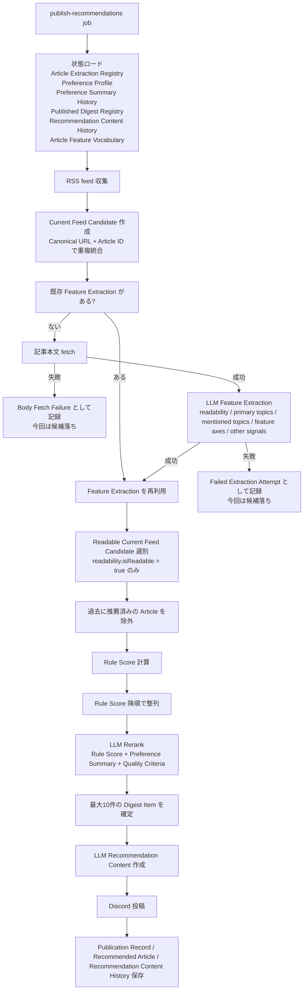

# Digest Flow

この文書は、現在の digest 実装が Article を収集してから、Rule Score と LLM Rerank を経て Owner に Digest Item を届けるまでの流れを説明する。

実装上の中心は `src/features/digest/application/run-zenn-digest-workflow.ts` である。ここで RSS 収集、Feature Extraction、Readable Article の選別、Rule Score、LLM Rerank、Recommendation Content 作成、Discord 投稿、state 保存が順に実行される。

## Overview



## Collection

Digest は configured feeds を順に読み、各 RSS entry から Current Feed Candidate を作る。

同じ Article が複数 feed に出た場合は、Canonical URL から導いた Article ID を基準に重複統合する。後から見つかった duplicate entry は別候補にはせず、既存候補に feed appearance を記録する。

Feed 単位の取得失敗は部分失敗として扱う。ただし全 feed が失敗した場合は workflow 全体を失敗させる。

## Feature Extraction

Current Feed Candidate ごとに、Article Extraction Registry に既存 Feature Extraction があるかを確認する。

既存 Feature Extraction がある Article は再抽出しない。これは LLM コストを抑え、同じ Article の分析結果を安定させるためである。

Feature Extraction がない Article では、まず本文を fetch する。本文 fetch に失敗した場合は Body Fetch Failure として保存し、その Article は今回の digest selection から落ちる。

本文 fetch に成功した場合は LLM Feature Extraction を実行する。LLM は Article Feature Vocabulary に従って、次の構造を返す。

- `readability`
- `primary_topics`
- `mentioned_topics`
- `feature_axes`
- `other_signals`

Feature Extraction が失敗した場合は Failed Extraction Attempt として保存し、その Article は今回の digest selection から落ちる。成功した場合は Article Extraction Registry に保存され、以後の run で再利用される。

## Readable Article Selection

Feature Extraction が存在し、かつ `readability.isReadable = true` の Article だけが Readable Current Feed Candidate として次の段階に進む。

`readability.isReadable = false` の Article は保存済み Feature Extraction として残るが、Digest Item にはならない。

## Rule Score

Rule Score は、Readable Current Feed Candidate を Recommendation Candidate に変換するときに計算される。過去に Published Digest Item として届いた Article、つまり Published Digest Registry の `recommendedArticles` に含まれる Article ID はこの段階で除外される。

Rule Score の計算式は、Article Features と Preference Profile の `feature_weights` による加重和である。

```txt
Rule Score =
  primaryTopics の weight * salience
+ mentionedTopics の weight * salience * 0.3
+ featureAxes の各 feature weight * salience
```

低 salience の signal はノイズとして扱う。

- `salience < 0.3` の signal は 0 点扱い
- `mentionedTopics` は `salience >= 0.7` のものだけが対象
- `mentionedTopics` の影響は `0.3` 倍
- weight が存在しない key は 0 点扱い

Rule Score 計算後、候補は Digest Selection Policy によって Rule Score 降順に並べられる。この時点の順序は、LLM Rerank に渡される初期順位である。

## LLM Rerank

LLM Rerank は、Rule Score で整列済みの候補から最終的な Digest Item を選ぶ段階である。

LLM に渡される主な情報は次の通り。

- `articleId`
- `title`
- `canonicalUrl`
- `ruleScore`
- `primaryTopics`
- Long-Term Preference Summary
- Recent Preference Summary
- Quality Criteria
- `maxRecommendations`

現在の実装では `maxRecommendations` の default は `10` である。

Quality Criteria は固定で、次の3つが使われる。

- 実務で再利用できる具体性がある
- 薄いニュースまとめや汎用 AI hype ではない
- 読む前に価値判断できる根拠がある

LLM は structured output として `selectedArticleIds` だけを返す。workflow はその Article ID の順番を最終順として採用する。

ただし、実装側で次の guard をかける。

- 存在しない Article ID は無視する
- 重複 Article ID は無視する
- `maxRecommendations` を超えた分は無視する

## Rule Score Order And Rerank Order

Rule Score と LLM Rerank で並び順が変わることはある。

Rule Score は Preference Profile の feature weights に基づく機械的な初期順位である。一方、LLM Rerank は Rule Score も見たうえで、Preference Summary と Quality Criteria を加味して `selectedArticleIds` を返す。

そのため、次のような並び替えは実装上起こり得る。

```txt
Rule Score order:
A: 12.0
B: 10.5
C: 9.8

LLM Rerank result:
B, A, C

Final Digest Item order:
B -> A -> C
```

つまり Rule Score は強い初期順位として働くが、最終的な Digest Item の順序は LLM Rerank が返した `selectedArticleIds` の順序で決まる。

## Recommendation Content And Publishing

LLM Rerank で選ばれた Digest Item だけに対して Recommendation Content を作る。

Recommendation Content は Owner-facing text であり、Feature Extraction とは責務が異なる。現在の structured output は次の内容を持つ。

- `summary`
- `whyRecommended`
- `learningPoints`
- `signalsUsed`

Recommendation Content 作成後、Discord に1 Article ずつ投稿する。投稿に成功した Article だけが Publication Record と Recommended Article として Published Digest Registry に記録される。

投稿に失敗した Article は `failedArticleIds` として扱われ、Recommended Article にはならない。そのため、実際に Owner に届かなかった Article が永久に推薦済み扱いになることはない。

## Why An Article Is Not Recommended

Digest audit では、推薦されなかった Article に対して主に次の理由が記録される。

- 過去に推薦済み
- 本文取得に失敗した
- Feature Extraction に失敗した
- Readable Article ではない
- Feature Extraction 結果がなく、Readable Article として扱えなかった
- Score 対象から除外された
- Rerank で落ちた
- Recommendation Content 作成または投稿前に除外された
- Discord 投稿に失敗した

この audit により、Article が collection から publication までのどこで落ちたのかを追跡できる。
